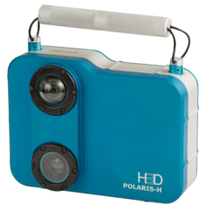
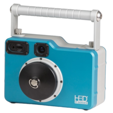
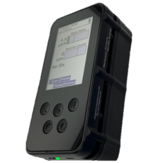
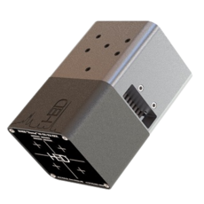
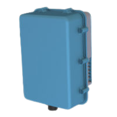

 

## Products &emsp; <a class="button button--primary button--rounded button--lg" href="h-series.html">H Series</a> <a class="button button--primary button--rounded button--lg" href="p-series.html">P Series</a> <a class="button button--primary button--rounded button--lg" href="a-series.html">A Series</a> <a class="button button--primary button--rounded button--lg" href="m-series.html">M Series</a> <a class="button button--primary button--rounded button--lg" href="s-series.html">S Series</a>

### H Series

- 실시간 방사선원 ID 및 이미징
- 360도 방사선 측정 및 이미징
- 공기/물 방수 및 청소용이
- 후처리를 통한 방사선량 정량화 계산
- 원자력 발전, 화생방 분야 최고의 포터블 검출기
   
   
  <a class="button button--secondary button--rounded button--lg" href="h-series.html">Learn more</a>
   
   

### P Series

- 실시간 방사선원 ID 및 이미징
- 방사선 핵종에 대한 정량적 측정
- 공기/물 방수 및 청소용이
- 후처리를 통한 방사선량 정량화 계산
- 방사선폐기물 분석
- 원자력발전소 내 파이프 또는 덕트에서의 정량적 해석
- 긴급대처상황, 사고상황, 또는 탈출상황에서 효과적
   
   
  <a class="button button--secondary button--rounded button--lg" href="p-series.html">Learn more</a>
   
   

### A Series

- 이동성이 용이 콤팩트하고 튼튼한 구조
- ANSI N42.34 기준을 초과한 디자인
- 실시간 360도 방사선원의 방향 파악
- 2인치 NaI(Tl) 에 버금가는 탐색능력
- 360도 방사선 측정 및 이미징
- 상온에서 HPGe 에 버금가는 에너지분해능
- 국경/국방 등에서 경비용으로 활용
   
   
  <a class="button button--secondary button--rounded button--lg" href="h-series.html">Learn more</a>
   
   

### M Series

- Mass-to-Volume 이 가장 극대화된 모델
- 상온에서 HPGe 에 버금가는 에너지분해능
- 콤팩트한 사이즈 및 무게 (~ 1kg)
- 실시간 방사선원 ID 및 이미징
- 다양한 어플리케이션 활용에 용이 (OEM integration)
   
   
  <a class="button button--secondary button--rounded button--lg" href="m-series.html">Learn more</a>
   
   

### S Series

- 실용적인 고성능 감마선 스펙트로미터
- 네트워크를 통한 실시간 방사선 감시
- 콤팩트한 사이즈 및 가벼운 무게
- 산업계에서 가장 우수한 상온반도체 성능
- 파이프 및 밸브의 감마선원 분석
- 원자력발전소 계획예방정비시 방사선 상시 모니터링
   
   
  <a class="button button--secondary button--rounded button--lg" href="s-series.html">Learn more</a>
   
   
